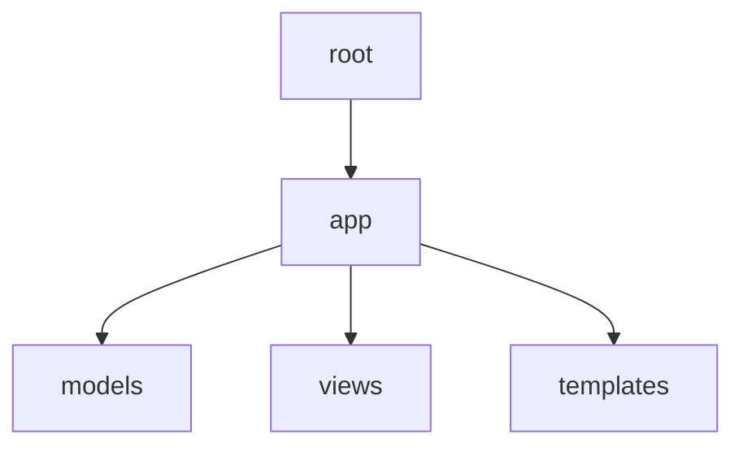

[](https://github.com/GrCOTE7)

[](https://cote7.com) [](https://www.instagram.com/grcote7) [](https://github.com/grcote7?tab=followers)

[](https://www.python.org/)



# FastAPI

Ce projet vise à explorer le développement d'architectures backend modernes avec **FastAPI**, **Python** (et éventuellement **Mojo** pour les performances de calcul intensif). 

## 📚 Documentation et Ressources

- 📘 **[Introduction à FastAPI & Exemples](./docs/fastapi_intro.md)** : Qu'est-ce que FastAPI, comment l'utiliser et le comparer.
- 🚀 **[Mojo vs Python](./docs/mojo_vs_python.md)** : Pourquoi Mojo pourrait être le futur pour les calculs intensifs.
- ⚖️ **[Django vs FastAPI](./docs/django_vs_fastapi.md)** : Comparatif et choix de l'architecture pour une plateforme multi-utilisateurs et crypto.
- 🤖 **[Estimation LLM en Local](./docs/llm_estimation.md)** : Plan et durée estimés pour créer et déployer un LLM minimaliste.
- 🎓 **[Tutoriels et Commandes Utiles](./docs/tutos_resources.md)** : Liens vidéos YouTube pour se former à FastAPI et astuces de commandes.

---

## 🛠️ Installation et Déploiement

### 1️⃣ Forker le projet
Fork [https://github.com/GrCOTE7/fastapi/fork](https://github.com/GrCOTE7/fastapi/fork) → Dans GH, avec *TON_USER_COMPTE*

### 2️⃣ Cloner en local
En CLI, dans le dossier de votre choix :
```bash
git clone git@github.com:TON_USER-COMPTE/PROJECT.git
cd PROJECT
```

### 3️⃣ Mettre en place l'environnement virtuel (.venv)
> **Note** : Utiliser Python 3.6.2 minimum (et 3.12 max).
> Exemple pour Windows : [Télécharger Python 3.12.10 (zip)](https://www.python.org/ftp/python/3.12.10/python-3.12.10-amd64.zip) et décompresser dans `C:\python312\`

```bash
# 1. Créer le virtual env
C:\python312\python.exe -m venv .venv

# 2. Activer le venv (Exemple)
.\.venv\Scripts\activate

# 3. Mettre à jour pip et installer les dépendances
python -m pip install --upgrade pip
pip install fastapi uvicorn scikit-image numpy scipy
# OU : pip install -r requirements.txt
```

### 4️⃣ Configuration de l'environnement
Renommez `.env_exemple` en `.env` et renseignez-y, si besoin, vos clés d'API (comme `MISTRAL_API_KEY`).
*(Vous pouvez en générer une sur [Mistral Console](https://console.mistral.ai/codestral/cli?workspace_dialog=apiKeys)).*

### 5️⃣ Enjoy ! 😊
```bash
# Lancement de FastAPI
uvicorn main:app --reload

# Autre exécution
python TheSCRIPT.py
```
